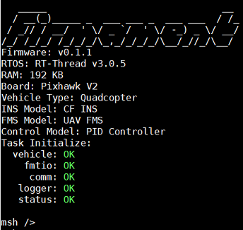

# 快速上手
## 硬件连接


硬件连接如图所示:

- `TELEM 2`: 默认作为控制台**Console**的输出，默认波特率*57600*。如果在**Mavlink Console**中输入任意字符，则**Console**将被自动映射到**Mavlink Console**上。
- `TELEM 1`: 默认作为**Mavlink**的输出口，默认波特率*57600*。如果**USB**连接的话，则**Mavlink**则自动换到到**USB**设备上输出。
- `GPS`: 连接GPS模块，默认波特率*9600*。
- `RC`: 连接遥控器的*PPM*信号,目前最多支持8路PPM信号。
- `SB`: 连接遥控器的*SBUS*信号，目前还未支持。
- `MAIN OUT`: 支持最多8路PWM输出信号 (也可改为捕获输入信号)。
- `AUX OUT`: 支持最多6路PWM输出信号 (也可改为捕获输入信号)。
- `其它`：其它接口暂时还未支持。

## 编译环境
支持在Windows/Linux/Mac环境下编译，需要用到的工具链如下：

- **编译器**: [*arm-none-eabi- toolchain*](https://developer.arm.com/tools-and-software/open-source-software/developer-tools/gnu-toolchain/gnu-rm/downloads) (推荐版本: `7-2018-q2-update`，其它版本未测试)
- **编译工具**：[*Scons*](https://sourceforge.net/projects/scons/files/scons/2.3.6/) (推荐版本：`v2.3.6`)，同时*Scons*需要用到*python2.7.x*
- **编辑器**：推荐*VS Code*。使用*VS Code*打开`FMT_Firmware/fmt_fmu`或者`FMT_Firmware/fmt_io`目录即可打开项目工程。
- **USB驱动**：下载 [STM32 USB驱动](https://www.st.com/en/development-tools/stsw-stm32102.html) (For windows)
## 编译固件

在配置好了编译环境后，首先需要配置系统的环境变量。以Windows系统为例，进入*Environment Variables*界面，添加一个`RTT_EXEC_PATH`的环境变量，并且将其*Value*设置为*arm-none-eabi- toolchain*的下载地址，比如`D:\gcc-arm-none-eabi-7-2018-q2-update-win32\bin`。

同时，在命令行窗口中输入`scons --version`和`python --version`查看版本是否正常。完成以上步骤后，可以开始编译FMT固件。

- 编译**FMT FMU**固件
```
cd FMT_Firmware/fmt_fmu/target/pixhawk
scons -j4
```
编译完成后，固件`fmt_fmu.bin`将生成在*build*目录下。

- 编译**FMT IO**固件
```
cd FMT_Firmware/fmt_io/Project
scons -j4
```
编译完成后，固件`fmt_io.bin`将生成在*build*目录下。

## 固件下载

### 下载FMT FMU固件
目前有两种方式下载FMU固件: 通过uploader.py脚本下载或者通过QGroundControl (QGC)下载。

- **uploader.py脚本：**
将飞控连接usb线插入PC，然后在`fmt_fmu/target/pixhawk`目录中执行`python uploader.py`。脚本将自动找到对应端口并开始下载位于*build*目录下的`fmt_fmu.bin`固件。

- **QGC地面站：**
进入*Firmware Setup*页面，然后使用usb线连接飞控和PC。这时会弹出选择固件的界面，选择`Advanced Settings`，然后在下拉框中选择`Custom firmware file`，然后选择编译的`fmt_fmu.bin`固件即可开始下载。


固件下载成功后，可以使用串口(**TELEM 2, baudrate: 57600**)或者QGC的**Mavlink Console**连接控制台(console)，如下图所示为飞控开机打印的信息：



除此之外，还可以在VS Code中运行`fmt_fmu/target/pixhawk/mavlink_shell.py`脚本来连接console。

### 下载FMT IO固件
协处理器IO的固件通过FMU的文件系统进行下载。首先需要连接将编译的`fmt_io.bin`固件放到sd卡上，可以通过读卡器拷贝。而更方便的方式是通过QGC的FTP功能进行文件上传 (*Widget->Onboard Files*)。

文件上传后，进入控制台(console)，输入如下指令:
```
uploader $path/fmt_io.bin
```
其中`$path`为存放*fmt_io.bin*的路径，如果是放在根目录，则可以省略，直接输入`uploader`即可。

**注意：**如果是第一次下载IO固件，在输入`uploader`指令后，需要手动按一下位于**Pixhawk**右侧的IO复位按钮，使得IO进入bootloader程序。

## 代码调试
FMT提供了丰富的调试手段，常用的比如通过console打印，log日志记录以及jtag连接进行单独调试。

##### Console打印
在FMU中可以调用`console_printf()`函数进行打印，用法类似`printf()`。信息将被打印显示在*console*设备上，支持中断上下文中打印。

##### ULOG日志
ULOG为rt-thread提供的文字日志系统，支持不同level等级的日志信息输出，比如*Error*,*Warning*,*Info*,*Debug*等，对应的函数接口为：
```
ulog_e(TAG, ...)	// Error
ulog_w(TAG, ...)	// Warning
ulog_i(TAG, ...)	// Info
ulog_d(TAG, ...)	// Debug
```
FMT支持将ulog日志输出到多个后端，比如*console*和*file system*。比如这条代码
```
ulog_e("Test", "Hello, this is %s", "FMT");
```
将在*console*打印如下信息，并且这条信息将被记录到`log/session_x/ulog.txt`中
```
[1770] E/Test: Hello, this is FMT
```

##### JTAG调试
TO BE ADD