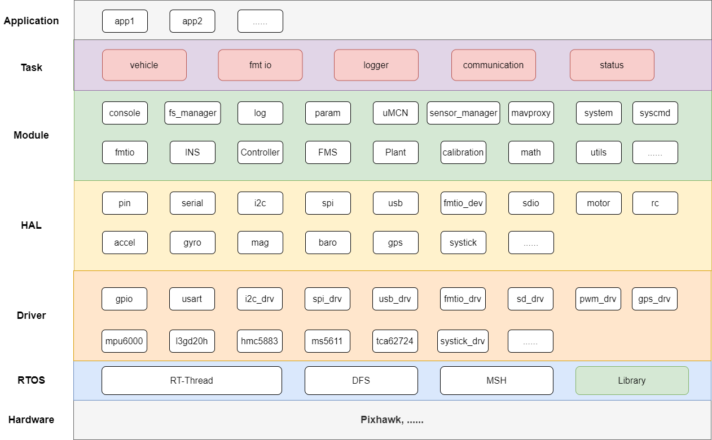

# Firmament概述

Firmament (FMT) 是一款专为基于模型开发 (MBD, Model Based Design) 而设计的开源飞控系统。FMT主要包括两部分：

- [FMT Firmware](https://github.com/FirmamentPilot/FMT_Firmware)：嵌入式飞控系统。提供安全稳定的嵌入式功能以及针对MBD开发而需要的功能模块和系统框架。
- [FMT Model](https://github.com/FirmamentPilot/FMT_Model)：基于模型设计的算法模块。可以直接生成C/C++源码并嵌入飞控系统中。除此之外，FMT Model还提供强大的仿真功能，如模型在环仿真 (MIL)，硬件在环仿真 (HIL) 和开环仿真 (Open Loop Simulation)。

## FMT Firmware
FMT Firmware主要用C语言编写，代码简洁易用。高度模块化的架构设计，使得代码移植和算法模块替换变得简单。FMT飞控基于Pixhawk V2的硬件进行开发，包括FMU(stm32F427)和IO(stm32F103)两个部分的固件。FMT支持Mavlink 1.0/2.0，所以可以支持主流的地面站，如QGC等。除此之外，FMT与其它主要开源飞控的主要区别之一在于其高度契合MBD的开发模式，能够基于Simulink快速设计，部署和验证你的算法模块。

## FMT Model
FMT Model为Simulink编写的算法模块，对于飞控系统来说，主要包含导航系统(INS)，飞行管理系统(FMS)和控制系统(Controller)三大算法模块。FMT Model通过Simulink Embedded Coder生成C/C++代码，只需简单copy到FMT Firmware相关模块中，即可完成算法的嵌入，而无需修改飞控的代码 (只要遵循FMT Model Interface标准)。FMT Model还包含无人机的物理模型(Plant)，从而可以支持模型在环仿真(MIL)和硬件在环仿真(HIL)，其它模型，如固定翼，VTOL等模型也会逐渐支持 (欢迎大家贡献！)。结合飞控系统的实时日志功能，可以将日志数据导入模型进行开环仿真(Open Loop Simulation)，得到和在硬件上运行完全一致的仿真结果。

# Firmament架构
FMT采用**分层设计模式，使得层与层，模块与模块之间去耦合，各个模块可以单独加载或删除**。 FMT架构如下图所示。

它具体包括以下部分：

- 内核层 (RTOS): 内核层采用实时操作系统RT-Thread,提供了例如多线程及其调度、信号量、邮箱、消息队列、内存管理、定时器等；DFS 是 RT-Thread 提供的虚拟文件系统组件，全称为 Device File System, 提供标准POSIX接口。MSH为RT-Thread提供的命令行系统组件，FMT基于MSH进一步封装，提供了丰富的指令。Library则包含一些三方库，如Mavlink, STIM32 Standard Library等。
- 驱动层 (Driver): 驱动层提供了Pixhawk板载和外扩的外设驱动支持，如IMU, GPS, 磁力计，气压计，SD卡，USB以及通信总线，如I2C，SPI，DMA等。
- 硬件抽象层 (HAL)： 在Driver层之上的HAL为上层提供统一的设备接口 (rt_read, rt_write, rt_control)，这样当替换不同的驱动设备或者移植到不同硬件上时，上层将不需要或者只需做很少的改动即可。一些与硬件无关的驱动逻辑也可以都放在HAL层中实现，这样就简化了驱动的开发难度。
- 模块层 (Module)：模块层提供FMT系统的基础功能模块，系统的大部分功能在这层实现，并提供给Task层进行组合，调用。比如跨进程通信模块uMCN提供基于发布/订阅模式的安全跨进程通信机制。log模块提供了二进制日志 (blog)和文字日志 (ulog)的功能。blog提供功能强大的数据记录功能，在不影响高优先级任务的前提下实时记录算法模块的输入/输入数据，供Simulink模型进行开环仿真。param参数模块提供方便的参数功能，支持命令行/地面站在线调参，并且参数将被记录到blog日志中，供仿真模块读取。算法模块INS, FMS, Controller为FMT Model生成的C/C++源文件，只要模块符合FMT Model Interface的标准，则可以直接嵌入到FMT飞控中，而无需做任何修改。Plant模块为无人机的物理模型 (也可以是其它对象模型)，同样为FMT Model生成。它主要是为了支持HIL Internal仿真模式，即无人机模型 (包括传感器模型)跑在飞控上而非外部的实时PC。
- 任务层 (Task)： 每个Task为一个单独的线程 (内部可以创建子线程) 实现独立的功能。比如最重要的Vehicle任务，将选择适合被控对象的INS，FMS和Controller组件，负责周期性运行模型并采集和发布模型的输入/输出数据，因此Vehicle任务具有最高优先级，以保证被控对象的稳定。FMT IO任务负责跟IO协处理器进行通信，IO将提供RC和Motor等相关的功能。Logger任务负责将采集blog和ulog的日志数据并存储到对应的存储设备，如SD卡。Communication任务使用mavproxy模块的接口提供mavlink通信相关的功能。Status任务的主要功能是显示当前系统的状态，可以通过LED，蜂鸣器和控制台等进行显示。
- 应用层 (App)  **(TODO)**: 应用层采用动态加载的模式，使用FMT提供的SDK实现一些复杂的任务功能，比如视觉避障，路径规划等。

## 展望
除了无人机以外，FMT也可以被用于无人车，无人船和机器人等无人控制系统。只需开发对应的算法模块 (INS, FMS和Controller)，也可从FMT Model中已有的模型库中选择适用的模型或者进行适当修改。往后期望广大开发者可以贡献新的模型库，使得FMT Model的模型库逐步壮大，以支持各种算法和不同的Vehicle。