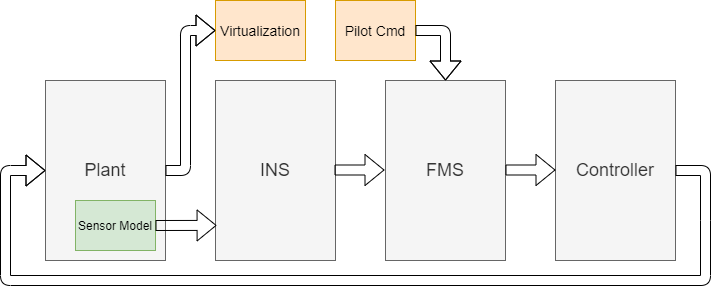

# 基于模型设计
基于模型的设计（Model-Based Design，简称MBD）是一种数学及可视化的设计方法，用来设计复杂的控制系统，信号处理系统和状态机等。目前大部分无人机飞控系统的研发手段还比较初级，基本都是嵌入式开发居多，大量的精力都花在嵌入式代码的编写、测试以及飞行逻辑的修改，对算法本身的开发和优化就不足。在已经成熟工业界，比如汽车，飞机制造，电力电子，航天等领域大量采用了基于Simulink的模型设计手段。

基于模型的开发省去了繁琐的代码编写步骤，结合 MATLAB/Simulink 强大的算法仿真和代码生成功能，通过可视化的方式轻松搭建算法模块。开发人员可以将更多的精力放在算法本身，而不需要过多关注代码实现的细节，这样将大大加快开发的效率，减少在代码编写过程中产生的错误。同时，基于模型的开发具有更好的代码复用性。也就是说，已经设计好的功能模块，只需要简单的复制/粘贴，就能快速地应用到其它任何地方，省去了代码移植过程的繁琐。

## 模型结构

Firmament 的开环仿真模型结构如下图所示：

Firmament 的模型主要由四个大的算法模块组成：

- Plant : 无人机或其它被控对象（无人车/传，机器人等）的物理模型。包括动力学模型（Dynamic Model），作动器模型（Actuator Model），环境模型（Environment Model）和传感器模型（Sensor Model）。
- INS : 惯性导航系统 (Inertial Navigation System) 模型。通过多传感器融合算法得到被控对象的状态信息，如姿态、速度和位置等。Firmament 目前提供了一个功能强大的基于互补滤波算法 (Complementary Filter) 的通用导航模型，支持的传感器包括： IMU，磁力计，气压计，GPS，超声测距仪和光流传感器等。导航输出的状态信息包括：姿态，速度，世界坐标位置 （经纬高），相对位置，对地高度，陀螺零偏，加速度零偏，传感器健康状态，导航系统状态等信息。适用于大部分的被控对象（无人机，无人机车/船，机器人等）和应用场景。
- FMS : 飞行管理系统 (Flight Management System) 或者说状态机（State Machine）。包括飞行模式控制，自动起飞降落，轨迹跟踪控制，安全检测等功能。
- Controller : 控制器模型。基于 FMS 输出的指令信息和 INS 输出的状态信息进行速度环、姿态环和角速度环的控制。控制器的输出经由控制分配模块（Control Allocation）输出电机控制信号。

各个模块可以单独生成 C/C++ 源码并嵌入到 Firmament 飞控系统中，并且各个算法模块可以以各自要求的频率执行。

>  注意：Firmament 默认 Plant、INS 以 500Hz 频率执行，FMS 以  125Hz 频率执行，Controller 以 250Hz 频率执行。

## 模型接口定义

为了可以支持不同的算法和被控对象的模型，Firmament 定义了一套标准的[模型接口](./interface.md)。

基于 Firmament 平台你可以快速开发新的算法模型（最简单的方式是基于 Firmament 已有的模型进行修改）并轻松部署到 Firmament 飞控系统中，而无需修改任何代码。当然前提是你的模型要遵循 Firmament 的[模型接口定义](./interface.md)。如果您要修改模型接口也是没有问题的，只需要对 Firmament 的嵌入式代码部分做简单修改即可。

## 模型仿真

### 模型在环仿真

### 硬件在环仿真

### 开环仿真

## 代码生成

## 代码部署

## 添加新的模型
